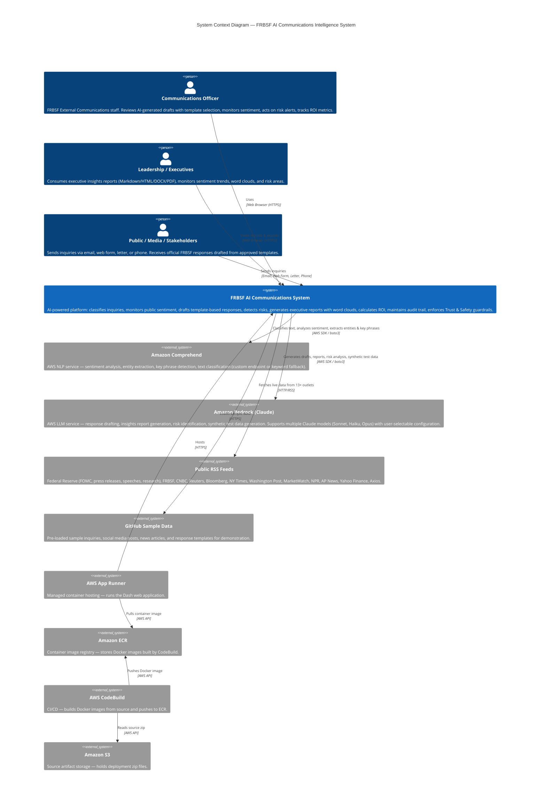

# C1 — System Context Diagram
## FRBSF AI Communications Intelligence System

## Actors

| Actor | Role | Interaction |
|-------|------|-------------|
| Communications Officer | Primary user — reviews AI drafts with template selection (30+ templates by category + audience), monitors sentiment, manages inquiry queue, classifies inquiries, tracks ROI | Web browser → Dash app (15 pages) |
| Leadership / Executives | Consumes AI-generated insights reports with word clouds, monitors sentiment trends by outlet and time period, reviews risk alerts | Web browser → Insights Report, Sentiment Monitor, Communications Hub |
| Public / Media / Stakeholders | Sends inquiries to FRBSF | Email, web form, letter, phone → Inquiry data |

## External Systems

| System | Purpose | Protocol |
|--------|---------|----------|
| Amazon Comprehend | NLP: sentiment analysis, entity extraction, key phrase detection, inquiry classification (custom endpoint or keyword fallback) | boto3 SDK |
| Amazon Bedrock (Claude) | LLM: draft responses using templates, insights reports, risk detection, synthetic test data generation. 7 model options (Sonnet v2, Haiku, Opus, cross-region variants) | boto3 SDK |
| Public RSS Feeds | Live news and Fed data — FOMC statements, press releases, speeches, FRBSF research + 13 news outlets (CNBC, NYT, Reuters, Bloomberg, WaPo, MarketWatch, NPR, AP, Yahoo Finance, Axios) | HTTP/RSS |
| GitHub | Sample demonstration data (inquiries, social media, news articles, response templates) | HTTPS |
| AWS App Runner | Managed container hosting | HTTPS |
| Amazon ECR | Docker image registry | AWS API |
| AWS CodeBuild | CI/CD pipeline | AWS API |
| Amazon S3 | Source artifact storage | AWS API |

## Application Pages (15)

| Page | Description |
|------|-------------|
| Overview | KPI dashboard with inquiry breakdown, sentiment summary, data source info, AI pipeline flow |
| Communications Hub | Trending topics, risk & negative sentiment alerts, sentiment donut chart |
| Inquiry & Response | Inquiry queue with filters, batch classification, AI draft with template selection by category + audience |
| Sentiment Monitor | Sentiment distribution, by-outlet analysis, trend over time (daily/weekly/monthly/quarterly/annual) |
| Insights Report | Word cloud (Fed in News), date-range filter, AI executive report, export to MD/HTML/DOCX/PDF |
| Risk Detector | Social media risk scanning via Bedrock |
| ROI Calculator | Time and cost savings from AI-assisted classification, drafting, and reporting |
| Live Fed Data | FOMC, press releases, speeches, news feeds with live fetch and sentiment analysis |
| Upload Data | JSON upload for inquiries, social media, or news articles |
| Audit Log | Full AI action history — timestamps, model IDs, action types, input/output summaries |
| Trust & Safety | Responsible AI posture, confidence metrics, guardrails (no policy predictions, no financial advice) |
| AI Model Config | Select active Bedrock Claude model from 7 available options |
| Generate Test Data | Synthetic data generation (inquiries, social media, news, templates) via Bedrock |
| Scoring & AI Info | Classification methodology and scoring rubrics |
| FAQ & Help | User guide and system documentation |

## Data Flow Summary

1. **Inbound**: Inquiries arrive from public/media/stakeholders → loaded via Upload JSON or Generate Test Data
2. **Classification**: Text → Amazon Comprehend → category, sentiment, confidence, key phrases, entities
3. **Drafting**: Inquiry + approved template (by category + audience) → Amazon Bedrock (Claude) → AI draft response
4. **Monitoring**: 13+ RSS feeds + Fed RSS → live fetch → Comprehend sentiment analysis → Sentiment Monitor
5. **Reporting**: All data sources → summary builder → Amazon Bedrock → executive insights report + word cloud → export (MD/HTML/DOCX/PDF)
6. **Risk Detection**: Social media posts → Amazon Bedrock → risk analysis with urgency ratings
7. **Test Data Generation**: User config (type, count, topics, dates) → Amazon Bedrock → synthetic JSON records → local storage
8. **Audit Trail**: Every AI action (LLM calls, classifications) → audit log → data/audit_log.json
9. **Deployment**: Source zip → S3 → CodeBuild → ECR → App Runner
