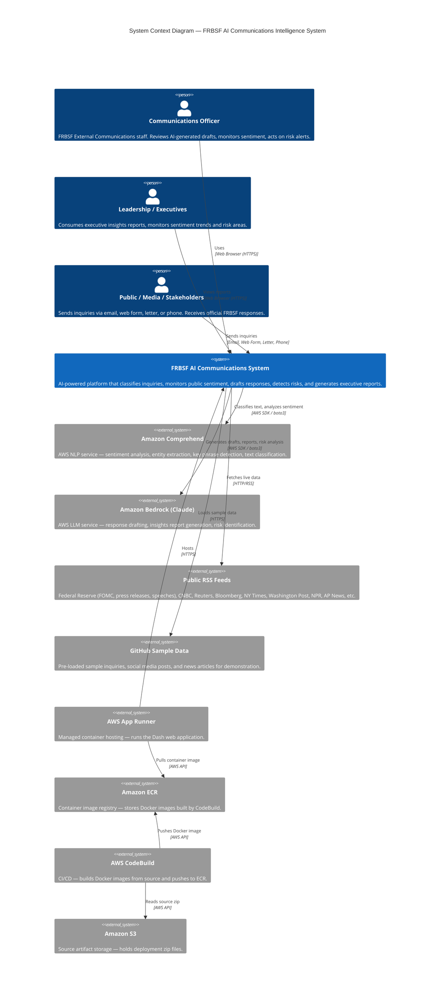

# C1 — System Context Diagram
## FRBSF AI Communications Intelligence System

## Actors

| Actor | Role | Interaction |
|-------|------|-------------|
| Communications Officer | Primary user — reviews AI drafts, monitors sentiment, manages inquiry queue | Web browser → Dash app |
| Leadership / Executives | Consumes insights reports, monitors trends | Web browser → Insights Report page |
| Public / Media / Stakeholders | Sends inquiries to FRBSF | Email, web form, letter, phone → Inquiry data |

## External Systems

| System | Purpose | Protocol |
|--------|---------|----------|
| Amazon Comprehend | NLP: sentiment, classification, key phrases, entities | boto3 SDK |
| Amazon Bedrock (Claude) | LLM: draft responses, insights reports, risk detection | boto3 SDK |
| Public RSS Feeds | Live news and Fed data (FOMC, speeches, press releases, news outlets) | HTTP/RSS |
| GitHub | Sample demonstration data | HTTPS |
| AWS App Runner | Managed container hosting | HTTPS |
| Amazon ECR | Docker image registry | AWS API |
| AWS CodeBuild | CI/CD pipeline | AWS API |
| Amazon S3 | Source artifact storage | AWS API |

## Data Flow Summary

1. **Inbound**: Inquiries arrive from public/media/stakeholders → loaded via Upload or Generate
2. **Classification**: Text → Amazon Comprehend → category, sentiment, confidence, key phrases
3. **Drafting**: Inquiry + template → Amazon Bedrock (Claude) → AI draft response
4. **Monitoring**: RSS feeds → keyword sentiment → merged into Sentiment Monitor
5. **Reporting**: All data → Amazon Bedrock → executive insights report
6. **Risk Detection**: Social media posts → Amazon Bedrock → risk analysis
7. **Deployment**: Source zip → S3 → CodeBuild → ECR → App Runner
