# C4 — Container Diagram
## FRBSF AI Communications Intelligence System

```mermaid
C4Container
    title Container Diagram — FRBSF AI Communications Intelligence System

    Person(comms_officer, "Communications Officer", "Reviews AI drafts, monitors sentiment, manages inquiry queue")
    Person(leadership, "Leadership / Executives", "Consumes executive insights reports, monitors trends")
    Person(public, "Public / Media / Stakeholders", "Sends inquiries via email, web form, letter, phone")

    System_Boundary(system, "FRBSF AI Communications System") {
        Container(dash_app, "Dash Web Application", "Python, Dash/Plotly", "Single-page app serving all UI pages: Overview, Communications Hub, Inquiry & Response, Sentiment Monitor, Insights Report, Risk Detector, ROI Calculator, Live Fed Data, Upload, Audit Log, Trust & Safety, AI Model Config, Test Data Generator, Scoring & AI Info, FAQ & Help")
        Container(pipeline, "Processing Pipeline", "Python", "Orchestrates end-to-end flow: load data → classify inquiries → analyze sentiment → build summary → generate report → detect risks")
        Container(data_loader, "Data Loader", "Python", "Merges data from local JSON files, GitHub sample data, Fed RSS feeds, and news outlet RSS feeds at startup and on refresh")
        Container(bedrock_svc, "Bedrock Service", "Python, boto3", "Invokes Amazon Bedrock Claude models for response drafting, insights report generation, risk identification, and synthetic test data generation")
        Container(comprehend_svc, "Comprehend Service", "Python, boto3", "Calls Amazon Comprehend for sentiment analysis, entity extraction, key phrase detection, and inquiry classification")
        Container(public_data_svc, "Public Data Service", "Python, requests", "Fetches live RSS feeds from Federal Reserve, FRBSF, CNBC, Reuters, Bloomberg, NYT, WaPo, MarketWatch, NPR, AP, Yahoo Finance, Axios")
        Container(response_templates, "Response Templates", "Python", "Registry of approved email templates keyed by (category, audience) with tone guidance and placeholder support")
        Container(datagen_svc, "Data Generation Service", "Python", "Generates synthetic test data (inquiries, social media, news, templates) via Bedrock Claude")
        Container(audit_log, "Audit Log", "Python, JSON", "Tracks all AI actions with timestamps, model IDs, input/output summaries; persists to data/audit_log.json")
        Container(wordcloud, "Word Cloud Utility", "Python, wordcloud/matplotlib", "Generates word cloud PNG images as base64 for embedding in the Insights Report")
        Container(local_data, "Local Data Store", "JSON files", "Stores generated test data, uploaded data, and audit logs in the data/ folder")
    }

    System_Ext(comprehend, "Amazon Comprehend", "AWS NLP — sentiment, classification, key phrases, entities")
    System_Ext(bedrock, "Amazon Bedrock (Claude)", "AWS LLM — drafting, reports, risk detection, data generation")
    System_Ext(rss_fed, "Federal Reserve RSS", "federalreserve.gov & frbsf.org — FOMC statements, press releases, speeches, research")
    System_Ext(rss_news, "News Outlet RSS Feeds", "CNBC, NYT, Reuters, Bloomberg, WaPo, MarketWatch, NPR, AP, Yahoo Finance, Axios")
    System_Ext(github, "GitHub Sample Data", "Pre-loaded sample inquiries, social media posts, news articles, response templates")
    System_Ext(apprunner, "AWS App Runner", "Managed container hosting for the Dash web application")
    System_Ext(ecr, "Amazon ECR", "Docker image registry")
    System_Ext(codebuild, "AWS CodeBuild", "CI/CD — builds Docker images and pushes to ECR")
    System_Ext(s3, "Amazon S3", "Source artifact storage for deployment zip files")

    Rel(comms_officer, dash_app, "Uses", "HTTPS")
    Rel(leadership, dash_app, "Views reports", "HTTPS")
    Rel(public, dash_app, "Submits inquiries", "Email, Web Form, Letter, Phone")

    Rel(dash_app, pipeline, "Triggers processing")
    Rel(dash_app, data_loader, "Loads / refreshes data")
    Rel(dash_app, bedrock_svc, "Drafts responses, generates reports")
    Rel(dash_app, comprehend_svc, "Classifies and analyzes text")
    Rel(dash_app, response_templates, "Selects templates by category + audience")
    Rel(dash_app, datagen_svc, "Generates synthetic test data")
    Rel(dash_app, audit_log, "Reads / writes audit entries")
    Rel(dash_app, wordcloud, "Generates word cloud images")
    Rel(dash_app, local_data, "Reads / writes JSON files")

    Rel(pipeline, data_loader, "Loads combined data")
    Rel(pipeline, comprehend_svc, "Classifies inquiries, analyzes sentiment")
    Rel(pipeline, bedrock_svc, "Generates insights report, detects risks")

    Rel(data_loader, public_data_svc, "Fetches live feeds")
    Rel(data_loader, github, "Downloads sample data", "HTTPS")
    Rel(data_loader, local_data, "Reads local JSON files")

    Rel(public_data_svc, rss_fed, "Fetches FOMC, press, speeches, research", "HTTP/RSS")
    Rel(public_data_svc, rss_news, "Fetches news articles", "HTTP/RSS")

    Rel(bedrock_svc, bedrock, "invoke_model", "boto3 / AWS SDK")
    Rel(bedrock_svc, audit_log, "Logs all LLM calls")
    Rel(comprehend_svc, comprehend, "detect_sentiment, classify_document, etc.", "boto3 / AWS SDK")
    Rel(datagen_svc, bedrock_svc, "Invokes Claude for data generation")

    Rel(apprunner, ecr, "Pulls container image", "AWS API")
    Rel(apprunner, dash_app, "Hosts", "HTTPS")
    Rel(codebuild, ecr, "Pushes Docker image", "AWS API")
    Rel(codebuild, s3, "Reads source zip", "AWS API")
```

## Containers

| Container | Technology | Responsibility |
|-----------|-----------|----------------|
| Dash Web Application | Python, Dash, Plotly | 15-page SPA: Overview, Communications Hub, Inquiry & Response, Sentiment Monitor, Insights Report, Risk Detector, ROI Calculator, Live Fed Data, Upload Data, Audit Log, Trust & Safety, AI Model Config, Generate Test Data, Scoring & AI Info, FAQ & Help |
| Processing Pipeline | Python | End-to-end orchestration: load → classify → sentiment → summarize → report → risk detect |
| Data Loader | Python | Merges local JSON, GitHub samples, Fed RSS, and news RSS into unified DataFrames |
| Bedrock Service | Python, boto3 | LLM gateway — response drafting, insights reports, risk identification, test data generation |
| Comprehend Service | Python, boto3 | NLP gateway — sentiment analysis, entity extraction, key phrases, inquiry classification |
| Public Data Service | Python, requests | RSS feed fetcher for Federal Reserve and 13+ news outlets |
| Response Templates | Python | 30+ approved email templates keyed by (category, audience) with tone and placeholder guidance |
| Data Generation Service | Python | Synthetic data generator for inquiries, social media, news articles, and templates |
| Audit Log | Python, JSON | Tracks all AI actions; persists to disk |
| Word Cloud Utility | Python, wordcloud, matplotlib | Generates word cloud images as base64 for dashboard embedding |
| Local Data Store | JSON files | Persistent storage for generated data, uploads, and audit logs |

## Key Data Flows

1. **Startup**: Data Loader merges local JSON + GitHub samples + Fed RSS + News RSS → unified DataFrames
2. **Inquiry Classification**: Text → Comprehend Service → category + sentiment + key phrases
3. **Response Drafting**: Inquiry + Template → Bedrock Service (Claude) → AI draft email
4. **Live Feed Refresh**: Public Data Service → Fed RSS + News RSS → merged into Sentiment Monitor
5. **Insights Report**: All data → Pipeline → Bedrock Service → executive report (Markdown/HTML/DOCX/PDF)
6. **Risk Detection**: Social media posts → Bedrock Service → risk analysis with urgency ratings
7. **Test Data Generation**: Data Generation Service → Bedrock Service → synthetic JSON records
8. **Audit Trail**: Every LLM call → Audit Log → data/audit_log.json
