# Component Diagram
## FRBSF AI Communications Intelligence System

```mermaid
C4Component
    title Component Diagram — Dash Web Application (app.py)

    Container_Boundary(dash, "Dash Web Application") {

        Component(sidebar, "Sidebar Navigation", "Dash HTML", "15-item navigation menu with role-based visual grouping; developer/test pages greyed out")

        ComponentDb(stores, "Client-Side Stores", "dcc.Store", "uploaded-data, model-store, data-refresh-signal, data-source-store")

        Component(overview, "Overview Page", "Dash/Plotly", "Dashboard with KPI metrics, inquiry breakdown charts, sentiment summary, data source info, and AI pipeline flow visualization")

        Component(hub, "Communications Hub", "Dash/Plotly", "Trending Topics, Risk & Negative Sentiment Alerts, Sentiment Analysis donut chart, recent activity feed")

        Component(inquiry, "Inquiry & Response Page", "Dash/Plotly", "Inquiry queue with category/priority/source filters, Classify All button, detail panel with AI draft generation, template selection by category+audience, re-draft with audience override")

        Component(sentiment, "Sentiment Monitor", "Dash/Plotly", "Sentiment distribution charts, sentiment by outlet, sentiment trend over time (daily/weekly/monthly/quarterly/annual), source breakdown")

        Component(insights, "Insights Report Page", "Dash/Plotly", "Word cloud (Fed in News), date-range filter, AI-generated executive report via Bedrock, export to Markdown/HTML/DOCX/PDF")

        Component(risks, "Risk Detector Page", "Dash/Plotly", "Scans social media posts via Bedrock for communication risks, misinformation, and urgent response needs")

        Component(roi, "ROI Calculator", "Dash/Plotly", "Calculates time and cost savings from AI-assisted inquiry classification, response drafting, and report generation")

        Component(feddata, "Live Fed Data Page", "Dash/Plotly", "Tabbed view: FOMC Statements, Press Releases, Speeches, News Feeds with per-source selection and item limits; Fetch Now with live sentiment analysis")

        Component(upload, "Upload Data Page", "Dash/Plotly", "Upload JSON files for inquiries, social media, or news articles; validates and merges into active dataset")

        Component(audit, "Audit Log Page", "Dash/Plotly", "Displays all AI actions: timestamps, model IDs, action types, input/output summaries")

        Component(trust, "Trust & Safety Page", "Dash/Plotly", "Responsible AI posture, confidence metrics, guardrail details (no policy predictions, no financial advice), model transparency")

        Component(settings, "AI Model Config", "Dash/Plotly", "Select active Bedrock Claude model from available options; persists selection to client store")

        Component(generate, "Generate Test Data", "Dash/Plotly", "Generate synthetic inquiries, social media, news articles, or templates via Bedrock; configurable count, batch size, date range, topics")

        Component(scoring, "Scoring & AI Info", "Dash/Plotly", "Category scoring rubrics, AI model information, classification methodology details")

        Component(faq, "FAQ & Help", "Dash/Plotly", "User guide, feature explanations, troubleshooting, and system documentation")

        Component(upload_handler, "Upload Handler", "Callback", "Parses uploaded JSON, validates schema, merges into uploaded-data store, triggers data refresh")

        Component(classify_handler, "Classification Handler", "Callback", "Batch-classifies all inquiries via Comprehend: category + sentiment + key phrases")

        Component(draft_handler, "Draft Handler", "Callback", "Generates AI draft responses via Bedrock using selected template and audience")

        Component(insights_handler, "Insights Generator", "Callback", "Builds summary from all data sources, invokes Bedrock for executive report, supports date filtering")

        Component(risk_handler, "Risk Detector Handler", "Callback", "Sends social media texts to Bedrock for risk identification")

        Component(live_refresh, "Live Data Refresh", "Callback", "Re-fetches Fed RSS + News RSS via Public Data Service, re-analyzes sentiment via Comprehend")

        Component(report_export, "Report Exporter", "Callback", "Converts insights report to Markdown, HTML, DOCX, or PDF for download")
    }

    Container_Ext(bedrock_svc, "Bedrock Service", "bedrock_service.py — LLM gateway to Amazon Bedrock Claude")
    Container_Ext(comprehend_svc, "Comprehend Service", "comprehend_service.py — NLP gateway to Amazon Comprehend")
    Container_Ext(data_loader_c, "Data Loader", "data_loader.py — Merges local + GitHub + RSS data")
    Container_Ext(public_data_svc, "Public Data Service", "public_data_service.py — RSS feed fetcher")
    Container_Ext(templates, "Response Templates", "response_templates.py — 30+ approved templates")
    Container_Ext(datagen, "Data Generation Service", "datagen_service.py — Synthetic data via Bedrock")
    Container_Ext(audit_svc, "Audit Log Service", "audit_log.py — Action tracking and persistence")
    Container_Ext(wc_util, "Word Cloud Utility", "wordcloud_util.py — PNG generation as base64")

    Rel(sidebar, overview, "Navigates to")
    Rel(sidebar, hub, "Navigates to")
    Rel(sidebar, inquiry, "Navigates to")
    Rel(sidebar, sentiment, "Navigates to")
    Rel(sidebar, insights, "Navigates to")
    Rel(sidebar, risks, "Navigates to")
    Rel(sidebar, roi, "Navigates to")
    Rel(sidebar, feddata, "Navigates to")
    Rel(sidebar, upload, "Navigates to")
    Rel(sidebar, audit, "Navigates to")
    Rel(sidebar, trust, "Navigates to")
    Rel(sidebar, settings, "Navigates to")
    Rel(sidebar, generate, "Navigates to")
    Rel(sidebar, scoring, "Navigates to")
    Rel(sidebar, faq, "Navigates to")

    Rel(upload, upload_handler, "Triggers on file upload")
    Rel(inquiry, classify_handler, "Triggers Classify All")
    Rel(inquiry, draft_handler, "Triggers Generate Draft")
    Rel(insights, insights_handler, "Triggers Generate Report")
    Rel(risks, risk_handler, "Triggers Detect Risks")
    Rel(feddata, live_refresh, "Triggers Fetch Now")
    Rel(insights, report_export, "Triggers Download")

    Rel(classify_handler, comprehend_svc, "Classifies + analyzes sentiment")
    Rel(draft_handler, bedrock_svc, "Generates AI draft")
    Rel(draft_handler, templates, "Selects template")
    Rel(insights_handler, bedrock_svc, "Generates executive report")
    Rel(insights_handler, wc_util, "Generates word cloud")
    Rel(risk_handler, bedrock_svc, "Identifies risks")
    Rel(live_refresh, public_data_svc, "Fetches RSS feeds")
    Rel(live_refresh, comprehend_svc, "Analyzes feed sentiment")
    Rel(generate, datagen, "Generates synthetic data")
    Rel(overview, data_loader_c, "Loads initial data")
    Rel(audit, audit_svc, "Reads audit log")
    Rel(upload_handler, stores, "Updates uploaded-data store")
    Rel(settings, stores, "Updates model-store")
```

## Component Summary

### UI Pages (15 pages)

| Page | Route | Key Features |
|------|-------|-------------|
| Overview | `/` | KPI dashboard, inquiry breakdown, sentiment summary, AI pipeline flow |
| Communications Hub | `/hub` | Trending topics, risk alerts, sentiment donut chart, activity feed |
| Inquiry & Response | `/inquiries` | Inquiry queue, filters, classify all, AI draft with template selection |
| Sentiment Monitor | `/sentiment` | Distribution charts, by-outlet analysis, trend over time periods |
| Insights Report | `/insights` | Word cloud, date filter, AI executive report, multi-format export |
| Risk Detector | `/risks` | Social media risk scanning via Bedrock |
| ROI Calculator | `/roi` | Time/cost savings calculator with configurable parameters |
| Live Fed Data | `/feddata` | FOMC, press, speeches, news feeds with live fetch and sentiment |
| Upload Data | `/upload` | JSON upload for inquiries, social media, news articles |
| Audit Log | `/audit` | Full AI action history with timestamps and model IDs |
| Trust & Safety | `/trust` | Responsible AI posture, guardrails, confidence metrics |
| AI Model Config | `/settings` | Bedrock Claude model selection (7 model options) |
| Generate Test Data | `/generate` | Synthetic data generation with topic/date/batch controls |
| Scoring & AI Info | `/scoring` | Classification methodology and scoring rubrics |
| FAQ & Help | `/faq` | User guide and system documentation |

### Backend Callbacks

| Handler | Trigger | Services Used |
|---------|---------|---------------|
| Upload Handler | File upload | Data validation, store update |
| Classification Handler | Classify All button | Comprehend Service |
| Draft Handler | Generate Draft button | Bedrock Service, Response Templates |
| Insights Generator | Generate Report button | Bedrock Service, Word Cloud Utility |
| Risk Detector Handler | Detect Risks button | Bedrock Service |
| Live Data Refresh | Fetch Now button | Public Data Service, Comprehend Service |
| Report Exporter | Download buttons | Markdown/HTML/DOCX/PDF conversion |

### Service Modules

| Module | File | External Dependency |
|--------|------|-------------------|
| Bedrock Service | `bedrock_service.py` | Amazon Bedrock (Claude) |
| Comprehend Service | `comprehend_service.py` | Amazon Comprehend |
| Public Data Service | `public_data_service.py` | Fed RSS, News RSS (13+ outlets) |
| Data Loader | `data_loader.py` | GitHub, local files, RSS feeds |
| Response Templates | `response_templates.py` | None (in-memory registry) |
| Data Generation Service | `datagen_service.py` | Amazon Bedrock via Bedrock Service |
| Audit Log | `audit_log.py` | Local filesystem (JSON) |
| Word Cloud Utility | `wordcloud_util.py` | None (in-memory generation) |
| Pipeline | `pipeline.py` | Orchestrates all services |
| Config | `config.py` | Environment variables, .env file |
